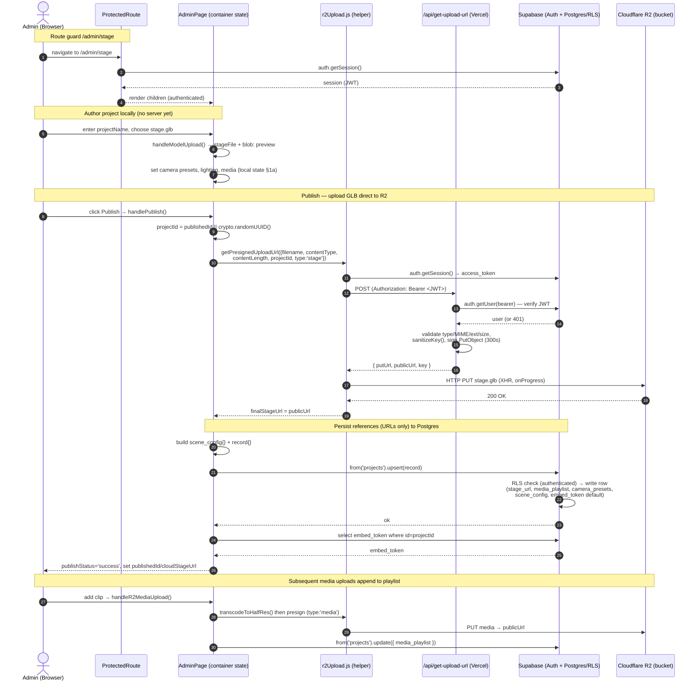

# Stage Visualizer — System Architecture

> Extracted strictly from source: `src/App.jsx`, `src/components/ProtectedRoute.jsx`, `src/lib/supabaseClient.js`, `src/pages/AdminPage.jsx`, `src/pages/PresentationEditorPage.jsx`, `src/components/UIPanel.jsx`, `src/components/StageCanvas.jsx`, `src/utils/r2Upload.js`, `api/get-upload-url.js`, `src/lib/trackingService.js`, and the realtime hooks under `src/hooks/`.

---

## 1. Frontend Framework & State Management

### Core stack (from `package.json`)
- **React 18.2** + **Vite 5** (`vite`, `@vitejs/plugin-react`), ES modules (`"type": "module"`).
- **react-router-dom 7** for client-side routing.
- **3D engine:** `three` 0.160 driven through **`@react-three/fiber`** (`Canvas`, `useFrame`, `useThree`), with **`@react-three/drei`** (`CameraControls`, `Grid`, `MeshReflectorMaterial`, `Environment`, `ContactShadows`), **`@react-three/postprocessing`** (`EffectComposer`, `Bloom`, `DepthOfField`), and **`@react-three/rapier`** for POV physics colliders.
- **Backend SDK:** `@supabase/supabase-js` 2 — a single shared client created in `src/lib/supabaseClient.js` from `VITE_SUPABASE_URL` / `VITE_SUPABASE_ANON_KEY` (throws on missing config).
- **Direct R2 signing:** `@aws-sdk/client-s3` + `@aws-sdk/s3-request-presigner` (used server-side in `api/`).
- **In-browser transcode:** `@ffmpeg/ffmpeg` (`transcodeToHalfRes`), `lucide-react` icons, `tailwindcss` for styling.

### State management strategy: **no global store**
There is **no Redux, Zustand, Jotai, or React Context** anywhere in `src/` (verified by search — no `createContext`/`create()`/`useReducer`). The application deliberately uses **local component state lifted into page-level container components**, passed down as explicit props, and synced to the backend on demand.

**Three state domains, each owned by a page container:**

#### a) 3D Stage state — owned by `src/pages/AdminPage.jsx`
`AdminPage` is the single source of truth for the live stage. It declares ~40 `useState`/`useRef` slices, grouped by concern (the file's own section comments):
- **Stage model:** `stageFile`, `stageUrl` (local `blob:` preview), `cloudStageUrl` (published R2 URL).
- **Media:** `videoPlaylist[]`, `activeVideoId`, `videoElement`, `activeImageUrl`, `isPlaying`, `isLooping`; `videoRef`, `clipCountRef`, `localBlobUrlsRef` (tracked blob URLs revoked on unmount).
- **Lighting/scene:** `sunAzimuth/Elevation/Intensity`, `gridCellSize`, `hdriPreset`, `customHdriUrl`, `envIntensity`, `bgBlur`, `bloomStrength`, `bloomThreshold`, `protectLed`, `transparentLedConfig`.
- **Camera:** `cameraPresets[]`, `cameraControlsRef`, `autoplayIntervalSeconds`, `cameraFlyDurationSeconds`.
- **Audience POV (Epic 1):** `povMode`, `povHeightOffset`, `meshMetadata`, `povColliderConfig` → derived `povColliderSpecs` via `useMemo(buildPovCollidersFromConfig, …)`.
- **Upload/publish lifecycle:** `isR2Uploading`, `r2UploadProgress`, `transcodeStatus`, `isPublishing`, `publishStatus`, `publishError`, `publishedId`, `embedToken`, `embedEnabled`.

Derived values use `useMemo` (e.g. `sunPosition`, `povColliderSpecs`); all mutations are wrapped in `useCallback` handlers. State is **flattened into a `scene_config` object only at save time** (see §2), never held as one monolithic object during editing.

#### b) Presentation/Feedback state — owned by `src/pages/PresentationEditorPage.jsx`
This page manages slides, director notes, references, annotations, and client feedback. It does **not** hit `supabase.from()` directly for this domain — it delegates to the data-access module **`src/lib/presentationVersions.js`** (see [[01_Product/Core_Concept#2. Presentation Versioning & Lifecycle (src/lib/presentationVersions.js, presentation_versions*.sql)|Presentation Versioning]]), importing `loadDraft`, `saveDraft`, `publishVersion`, `restoreVersion`, `loadFeedback`, `setFeedbackStatus`, `buildSnapshot`, `snapshotDiff`, `VersionConflictError`, etc. Editor state is built into the `snapshot_json` payload via `buildSnapshot(projectName, slides, cameraPresets)`.

#### c) Realtime collaboration state — Supabase Realtime hooks (`src/hooks/`)
Cross-client state is **not** in a store; it rides on Supabase Realtime channels:
- **`useCollaborativeEditing(projectId, userInfo, onApplyOp)`** — broadcast channel `collab:presentation:${projectId}`, event `slide_op`. Emits/receives `slide_update | slide_add | slide_delete | slide_reorder`; echoes from `payload.by === userInfo.userId` are ignored. Returns `broadcastOp`.
- **`useVersionWatcher(projectId, currentVersionToken, onRemoteSave)`** — subscribes to `postgres_changes` UPDATE on `presentation_versions` filtered by `project_id`; fires `onRemoteSave` only when the row's `version_token` differs from the locally loaded token (drives the conflict banner; pairs with the optimistic-lock `VersionConflictError`).
- **`usePresenceChannel`** — presence avatars of co-editors.

Auth/session "state" is read directly from `supabase.auth.getSession()` / `onAuthStateChange` at the points it's needed (e.g. `ProtectedRoute`), not cached globally.

---

## 2. Data Flow Pipeline (Upload & CDN)

Large binaries (GLB stage models, HDR/EXR environments, MP4/image media) **never transit the Vercel application server**. They go **browser → presigned PUT → Cloudflare R2** directly. Supabase only ever stores the resulting **URL string** inside the `projects` row.

### Step-by-step (media/HDRI upload — `AdminPage.handleR2MediaUpload` / `handleR2HdriUpload`)
1. **Client-side guard:** `validateMediaFile(file)` checks extension/MIME; a `projectName` must be set.
2. **Transcode (video only):** `transcodeToHalfRes(file, { onStatus, onProgress })` runs `@ffmpeg/ffmpeg` in-browser to half-res H.264; images pass through. Progress surfaces via `transcodeStatus`.
3. **Request presigned URL:** `getPresignedUploadUrl({ filename, contentType, contentLength, projectId, type })` (`src/utils/r2Upload.js`) `POST`s to **`/api/get-upload-url`** with an `Authorization: Bearer <supabase access_token>` header pulled from `supabase.auth.getSession()`.
4. **Server signs (`api/get-upload-url.js`):** verifies the bearer JWT (`supabase.auth.getUser`), validates `type` ∈ `media|hdri|stage|snapshot` against per-type MIME/extension/byte limits (see [[01_Product/Core_Concept#Direct-to-R2 Asset Upload (src/utils/r2Upload.js, api/get-upload-url.js)|upload matrix]]), builds a sanitized key (`{project}/{type}/{ts}_{name}`), and returns a 300s-expiry presigned **PUT** URL plus the derived `publicUrl`. Snapshots optionally route to `R2_PRIVATE_BUCKET` (no public URL).
5. **Direct PUT to R2:** `uploadFileToPresignedUrl(putUrl, file, publicUrl, onProgress)` issues an `XMLHttpRequest` PUT straight to R2, streaming `upload.progress` into `r2UploadProgress`. Content-Type must match what was signed (else R2 403s `SignatureDoesNotMatch`).
6. **Resolve URL:** on 2xx the helper resolves to `publicUrl` (the R2 public-base CDN URL).
7. **Persist reference to Supabase:** the new clip is appended to `videoPlaylist`; if `publishedId` exists, `supabase.from('projects').update({ media_playlist: mediaForDb })` writes the URL array immediately. (No file bytes touch Postgres.)

### Stage model + full save (`AdminPage.handlePublish`)
1. `projectId = publishedId || crypto.randomUUID()`.
2. If a new `stageFile` exists → presign with `type: 'stage'` → PUT to R2 → `finalStageUrl`.
3. Build `media_playlist` (filtering out `blob:`/`data:` URLs) and resolve `finalHdriUrl`.
4. Assemble the `scene_config` JSONB snapshot (lighting, HDRI, bloom, LED protection, sun vector, autoplay/fly timings, `versionStatus`, `povColliderConfig`).
5. `supabase.from('projects').upsert(record)` writes `{ id, stage_url, video_url, media_playlist, camera_presets, grid_cell_size, name, scene_config, pov_height_offset, embed_enabled }` (the `projects` row — see [[01_Product/Core_Concept#`projects`|projects schema]]).
6. Read back `embed_token` and set `publishedId` / `cloudStageUrl`; report `publishStatus`.

### Read-side / analytics
- The 3D viewer pulls assets back through `secureAssetLoader` (`fetchAndCacheAsset`) for caching; private snapshots are re-signed via `/api/get-snapshot-url`.
- Engagement is **batched, not direct**: `src/lib/trackingService.js` debounces (`DEBOUNCE_MS=400`) and batches (`FLUSH_INTERVAL_MS=800`, `FLUSH_MAX_ITEMS=10`) events, then calls `supabase.rpc('batch_increment_project_stats', …)` with a per-RPC fallback to `increment_project_stat` / `increment_project_jsonb_key` (see [[01_Product/Core_Concept#`projects`|aggregate counters]]).

---

## 3. Routing Logic & Admin UI Component Architecture

### Routing strategy (`src/App.jsx`)
`<BrowserRouter>` wraps a `<Routes>` table inside a top-level `PageErrorBoundary` (which auto-reloads with a cache-busting `?appv=` param on stale-chunk errors). Heavy routes are `React.lazy` + `Suspense` code-split: `EmbedPage`, `PresentationEditorPage`, `AdminFeedbackReviewPage`, `AdminDataPage`.

| Path | Component | Guard |
|------|-----------|-------|
| `/` | `LoginPage` | public |
| `/privacy` | `PrivacyPage` | public |
| `/admin` | `AdminLandingPage` | `<ProtectedRoute>` |
| `/admin/stage` · `/admin/stage/:stageProjectId` | `AdminPage` | `<ProtectedRoute>` |
| `/admin/data` | `AdminDataPage` (lazy) | `<ProtectedRoute>` |
| `/admin/:projectId/presentation` | `PresentationEditorPage` (lazy) | `<ProtectedRoute>` |
| `/admin/:projectId/feedback` | `AdminFeedbackReviewPage` (lazy) | `<ProtectedRoute>` |
| `/collab/:projectId` | `CollabPage` | public (shareable) |
| `/view/:projectId` | `ClientPage` | public |
| `/embed/:embedToken` | `EmbedPage` (lazy) | public (opaque token) |
| `*` | `→ Navigate to="/"` | — |

This guard map enforces the privilege tiers defined in [[01_Product/Core_Concept#2. Target Users|Target Users]]: every `/admin/*` surface is gated; client/collab/embed surfaces are open.

### `<ProtectedRoute>` logic (`src/components/ProtectedRoute.jsx`)
A three-state session machine: `session === undefined` (loading → spinner), `null` (no session → `<Navigate to="/" replace />`), or an object (render `children`). On mount it calls `supabase.auth.getSession()`, then subscribes to `supabase.auth.onAuthStateChange` so a sign-out in another tab redirects live; the subscription is cleaned up on unmount. It guards **only the client-side render** — the actual authority is the Supabase **JWT re-verified server-side** by `api/get-upload-url.js` and `api/lib/adminApiCommon.js` (`verifyBearerUser`) on every privileged request, and by Postgres **RLS** (see [[01_Product/Core_Concept#2. Target Users|role policies]]).

### Admin component architecture: **container ↔ presentational split**

```
AdminPage  (CONTAINER — owns state, handlers, Supabase + R2 I/O)
├── StageCanvas        (R3F <Canvas> host; error boundaries; POV rigs)
│   └── Scene          (3D model, LED materials, lighting, camera controls)
├── UIPanel            (PRESENTATIONAL — control surface, ~50 props in)
├── TopBar / RoleBadge (presentational chrome)
├── ClientRadarPanel   (live viewer analytics readout)
└── ProjectsDashboard  (modal: own data-fetching for project list/CRUD)
```

- **`AdminPage` (container):** holds all state (§1a), defines every mutation handler (`handleR2MediaUpload`, `handlePublish`, `handleCloneAsNewRound`, `handleRegenerateEmbedToken`, …), and is the only component issuing `supabase.from('projects')`/`.rpc('clone_project')` calls plus R2 uploads. It owns no markup of its own controls.
- **`UIPanel` (presentational):** receives ~50 explicit props — pure value/`onX` callback pairs (`videoPlaylist` + `onR2MediaUpload`, `sunAzimuth` + `onSunAzimuthChange`, `cameraPresets` + `onSaveView`, `embedToken` + `onRegenerateEmbedToken`, `publishStatus`/`publishError`, etc.). It renders the control surface and calls back up; it holds no server state.
- **`StageCanvas` (presentational + boundaries):** wraps the `@react-three/fiber` `<Canvas>` in `StageErrorBoundary` and a `PovRuntimeBoundary` (degrades gracefully if CSP blocks Rapier's `eval`), lazy-loads `PovFpsRig`/`PovSimpleRig`, and renders `<Scene>` with the props handed down from `AdminPage`.
- **`ProjectsDashboard` (hybrid):** a modal container that does its **own** Supabase reads — fetches the project list, groups rows by `group_id ?? id` (project "rounds"/stacking from [[01_Product/Core_Concept#`projects`|group_id]]), and exposes clone/rename/delete/lock with inline `Spinner`/`ErrorBanner`/`Toast` presentational subcomponents.

`PresentationEditorPage` follows the same pattern at its own altitude: it is the container (state + realtime hooks + `presentationVersions.js` I/O), delegating UI to `VersionHistoryDrawer`, `DirectorNotesEditor`, `AnnotationLayer`/`AnnotationToolbar`, and `PresenceAvatars`.

---

## 4. System Data Flow Diagram

Complete lifecycle: **create a project → upload a GLB stage asset to R2 → save state to Supabase** (per `AdminPage.handlePublish` + `r2Upload.js` + `api/get-upload-url.js`).



### Diagram notes (from code)
- The application server (`/api/get-upload-url`) only ever sees JSON metadata + signs a URL — **file bytes flow Admin → R2 directly** over the presigned PUT.
- Postgres stores **only URL strings** (`stage_url`, `media_playlist[].url`, `scene_config.customHdriUrl`); see [[01_Product/Core_Concept#4. Data Models & Schemas|Data Models]].
- `embed_token` is populated by the column default on insert, then read back for the shareable embed link.
- Authorization is enforced **twice**: `verifyBearerUser` (JWT) at the API edge and **RLS** at the database — `<ProtectedRoute>` is UX-only.
